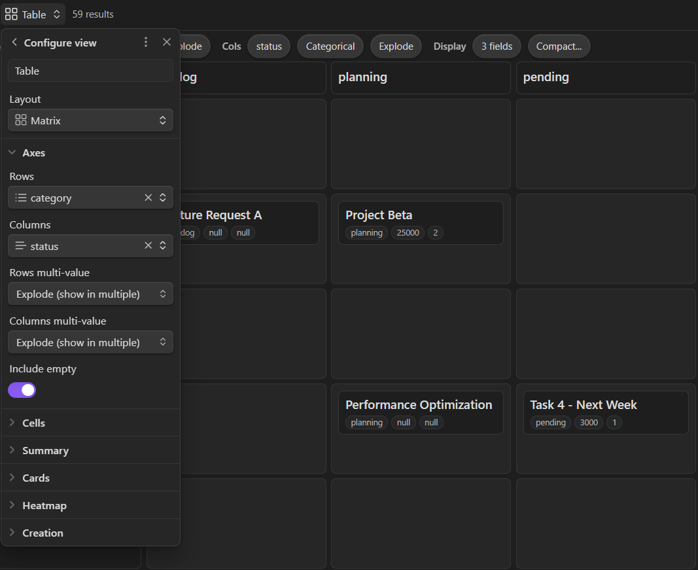

# Bases Grid View

A powerful Grid view for Obsidian's Bases feature that displays data in interactive 2D grids (or matrices!) with advanced bucketing and drag-and-drop functionality.



## TL;DR 🚀

**What it does:** Transform your notes into custom interactive 2D grids - perfect for project management, content calendars, budget tracking, and any data that fits a grid.

**Key Features**
- 🧩 **Matrix from your metadata**: Pick any two frontmatter fields to build a Rows × Columns grid  
- 📎 **Card details**: Show chosen properties as pills, plus optional per-cell summaries (sum/avg/min/max)  
- ✋ **Drag → updates frontmatter**: Move cards between cells to change their properties (only when it’s safe/reversible)  
- 🪣 **Powerful bucketing**: Categorical, date buckets (Overdue/Today/This Week…), number ranges, and quantiles  
- 🗂️ **Multi-value aware**: Tags/arrays can be Disallow, Primary, or Explode into multiple cells  
- 🖼️ **Card thumbnails**: Show images from a frontmatter field or the first embedded image (remote optional)  
- 📊 **Count heatmap**: Cells tint by how full they are so hotspots pop instantly  
- 👁️ **Hover preview**: Peek note content without leaving the grid *(if enabled)*  

**Quick Start:**
1. Install plugin → Create/open `.base` file → Add Grid view
2. Pick row + column properties in the axis bar
3. Choose bucketing strategies (Categorical/Date/Number)
4. Drag cards between cells to reorganize data

**Requirements:** Obsidian 1.10.0+ with Bases enabled

## Features

### 🏗️ **Advanced Grid Visualization**
- **2D Grid Layout**: Display any two properties as rows and columns
- **Interactive Cells**: Click cells to drill down into specific combinations
- **Sticky Axis Bar**: Always-visible configuration summary with interactive controls

### 📊 **Smart Bucketing System**
Choose how to group your data with four bucketing strategies:

#### **Categorical** (Default)
- Groups by exact text values
- Supports drag-and-drop reordering
- Perfect for status, priority, category fields

#### **Date Relative**
- Groups dates into: Overdue, Today, This Week, Next Week, This Month, Later
- Automatically updates based on current date
- Great for deadline and schedule tracking

#### **Number Ranges**
- Custom numeric ranges (e.g., "Low: 0-3", "Medium: 3-7", "High: 7+")
- Perfect for priority scores, budgets, ratings

#### **Number Quantiles**
- Automatic statistical distribution (Q1, Q2, Q3, Q4)
- Data-driven grouping based on your actual values
- Ideal for analyzing distributions

### 🔄 **Multi-Value Support**
Handle properties with arrays intelligently:

#### **Disallow** (Safe Default)
- Prevents drag-and-drop when arrays are present
- Ensures data integrity

#### **Explode**
- Items with multiple values appear in **multiple cells**
- Example: `tags: [work, urgent]` appears in both "work" and "urgent" columns

#### **Primary**
- Uses only the first value for bucketing
- Other values are preserved but not displayed

### 🎯 **Drag-and-Drop Functionality**
- **Safe Reordering**: Move items between buckets with intelligent conflict resolution
- **Multi-Value Aware**: Different behaviors for Explode vs Primary modes
- **Status Indicators**: Clear feedback about when drag-and-drop is available
- **Data Integrity**: Prevents operations that could lose information

### 👁️ **Hover Preview**
- **Instant Previews**: Hover over any card to see the full note content
- **Obsidian Native**: Uses Obsidian's built-in hover preview system
- **Configurable**: Toggle on/off in settings (enabled by default)
- **Smart Debouncing**: Prevents spam with 200ms delay

### 🖼️ **Card Thumbnails**
- **Multiple Sources**: Frontmatter field, first embedded image, or disabled
- **Size Options**: Small or medium thumbnails
- **Remote Support**: Optional loading of external URLs
- **Smart Resolution**: Automatic path resolution and error handling

### 📱 **Display Modes**
- **Cards**: Full card layout with titles, metadata, and thumbnails
- **Compact**: Subtitle-only cards for dense displays
- **Count Only**: Numbers only for overview matrices

### 📊 **Cell Summaries**
- **Multiple Metrics**: Count, Sum, Average, Min, Max
- **Numeric Fields**: Aggregate any numeric property
- **Visual Indicators**: Summary chips in cell headers

### 🔥 **Heatmap Visualization**
- **Count-Based**: Visual intensity based on cell population
- **Customizable Strength**: Adjust opacity (0-60%)
- **Scale Options**: Linear or logarithmic scaling

### 🔧 **Advanced Cell Controls**
- **Cell Sorting**: Sort cards within cells by any property (ascending/descending)
- **Card Fields**: Customize which frontmatter fields appear on cards
- **Max Cards**: Limit visible cards per cell with overflow indicators

### 🎛️ **Interactive Configuration**
- **Property Picker**: Searchable dropdown to choose row/column properties
- **Bucketing Controls**: One-click access to bucketing configuration
- **Multi-Mode Selector**: Quick toggling between multi-value handling modes
- **Real-time Updates**: Changes take effect immediately without reloading

## Installation

### From Obsidian Community Plugins
1. Open Settings → Community plugins
2. Browse and search for "Bases Grid View"
3. Install and enable the plugin

### Manual Installation
1. Download `main.js`, `styles.css`, and `manifest.json` from the [latest release](https://github.com/your-repo/releases)
2. Create folder: `VaultFolder/.obsidian/plugins/bases-grid-view/`
3. Copy files into the folder
4. Reload Obsidian and enable in Community plugins

## Usage

### Basic Setup
1. Create or open a `.base` file in your vault
2. Add the Grid view from the view picker
3. Configure row and column properties using the axis bar chips
4. Choose bucketing strategies for each axis
5. Set multi-value handling modes as needed

### Configuration Options

#### View Configuration (Bases Configure Panel)
- **Rows Property**: Choose which frontmatter property defines row groupings
- **Columns Property**: Choose which frontmatter property defines column groupings
- **Include Empty**: Whether to show empty buckets (enabled by default)
- **Cell Display**: Choose between Cards, Compact, or Count-only display
- **Max Cards**: Limit cards shown per cell (default: 6)
- **Enable Drag**: Toggle drag-and-drop functionality (enabled by default)
- **Show Count Chip**: Display item count in cell headers (enabled by default)
- **Enable Hover Preview**: Toggle hover preview functionality (enabled by default)

#### Advanced Configuration (Interactive Axis Bar)
- **Bucketing**: Click any bucketing chip to configure grouping strategy
- **Multi-Value Mode**: Click mode chips to change array handling
- **Property Selection**: Click property chips to choose different fields
- **Card Fields**: Select which frontmatter fields to display on cards
- **Thumbnail Field**: Choose which field contains image paths

#### Cell Features
- **Cell Sorting**: Sort cards within cells by any property (ascending/descending)
- **Cell Summary**: Display count, sum, average, min, or max for numeric fields
- **Heatmap**: Visual intensity based on cell population with customizable strength and scale

#### Card Customization
- **Card Fields**: Comma-separated list of frontmatter fields to display
- **Compact Fields**: Fields shown as subtitles in compact mode
- **Compact Max Fields**: Limit subtitle fields in compact mode (default: 2)
- **Card Thumbnails**: Off, frontmatter field, or first embedded image
- **Thumbnail Size**: Small or medium
- **Allow Remote Thumbs**: Enable loading of external image URLs

#### Creation & Templates
- **Default Template**: Path to note template for new cards
- **Template Folder**: Last-used folder for new notes

#### Advanced Configuration (Interactive Axis Bar)
- **Bucketing**: Click any bucketing chip to configure grouping strategy
- **Multi-Value Mode**: Click mode chips to change array handling
- **Property Selection**: Click property chips to choose different fields

### Example Use Cases

#### Project Management
```
Rows: status (Categorical)
Columns: priority (Number Ranges: Low|1-3, Medium|4-6, High|7-10)
Multi-value: Primary
```
Track projects across completion status and priority levels.

#### Content Calendar
```
Rows: publish_date (Date Relative)
Columns: category (Categorical)
Multi-value: Explode
```
Plan content across time periods with multi-category support.

#### Budget Tracking
```
Rows: department (Categorical)
Columns: budget (Number Quantiles)
Multi-value: Disallow
Cell Summary: Average
Heatmap: Enabled
Card Fields: project_name, manager
```
Analyze budget distributions across departments with visual heatmaps and project details.

#### Creative Writing Pipeline
```
Rows: status (Categorical: Draft, Editing, Review, Published)
Columns: word_count (Number Ranges: Short|0-1000, Medium|1000-5000, Long|5000+)
Cell Display: Cards with thumbnails
Hover Preview: Enabled
Cell Sorting: By last_modified (descending)
```
Track writing progress with visual previews and automatic organization.

## Requirements

- **Obsidian**: 1.10.0 or later (Bases feature required)
- **Platform**: Desktop and mobile supported

## Development

### Setup
```bash
npm install
npm run dev  # Watch mode
npm run build  # Production build
```

### Project Structure
```
src/
├── main.ts                 # Plugin entry point
├── bases/
│   ├── matrixView.ts       # Main grid view component
│   ├── bucketEngine.ts     # Bucketing logic
│   ├── bucketSpec.ts       # Type definitions
│   ├── multiValue.ts       # Multi-value handling
│   ├── valueCodec.ts       # Data transformation
│   ├── axisState.ts        # Configuration persistence
│   ├── thumbResolver.ts    # Image thumbnail resolution
│   ├── frontmatterMerge.ts # Template merging utilities
│   └── cardConfig.ts       # Card field configuration
└── ui/
    ├── axisBar.ts                # Interactive axis configuration
    ├── bucketConfigModal.ts      # Bucketing setup
    ├── propertyPickerModal.ts    # Property selection
    ├── drilldownModal.ts         # Cell detail view
    ├── cardFieldsPickerModal.ts  # Card field selection
    ├── cardFieldsTemplateEditor.ts # Template editor
    ├── createNoteModal.ts        # Note creation dialog
    ├── textPromptModal.ts        # Text input prompts
    └── filePickerModal.ts        # File selection
```

## Contributing

1. Fork the repository
2. Create a feature branch
3. Make your changes
4. Add tests for new functionality
5. Submit a pull request

## License

MIT License - see [LICENSE](LICENSE) file for details.

## Support

- **Issues**: [GitHub Issues](https://github.com/your-repo/issues)
- **Discussions**: [GitHub Discussions](https://github.com/your-repo/discussions)
- **Documentation**: [Bases Documentation](https://docs.obsidian.md/plugins/guides/bases-view)
- **Buy me a coffee**: If you find this plugin helpful, consider supporting its development at [BuyMeACoffee](https://buymeacoffee.com/brielms)

## Changelog

### v0.0.3
- **Hover Preview**: Native Obsidian hover previews with configurable toggle
- **Card Thumbnails**: Support for frontmatter images and embedded images
- **Compact Mode**: Dense card display with subtitle fields
- **Cell Sorting**: Sort cards within cells by any property
- **Cell Summaries**: Count, sum, average, min, max for numeric fields
- **Heatmap Visualization**: Visual intensity with strength and scale controls
- **Enhanced Error Handling**: Improved stability with file sync issues

### v0.0.2
- **Advanced Card Customization**: Configurable card fields and metadata display
- **Template Support**: Note creation with custom templates
- **Improved UI**: Enhanced axis bar and configuration controls
- **Better Validation**: File existence checks and error handling

### v0.0.1
- Initial release with basic grid functionality
- Categorical bucketing support
- Drag-and-drop reordering
- Multi-value array handling (Disallow/Explode/Primary)
- Interactive axis bar with live configuration
- Advanced bucketing: Date Relative, Number Ranges, Number Quantiles
- Comprehensive status indicators and user feedback
